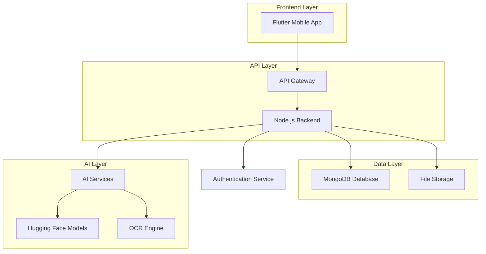

# ⚖️ LawMate – AI-Powered Legal & Policy Assistant

[](https://opensource.org/licenses/MIT)
[](https://flutter.dev)
[](https://nodejs.org)
[](https://mongodb.com)

> **Democratizing Legal Knowledge** - Making Indian laws, policies, and government schemes accessible to every citizen through AI-powered simplification and intelligent search.

## 📌 Overview

LawMate is an AI-powered legal and policy assistant designed to democratize access to Indian legal knowledge. Our platform transforms complex legal documents, government policies, and citizen schemes into easily understandable content, empowering citizens to navigate the legal landscape with confidence.

### Key Benefits
- **Simplified Legal Language**: Complex legal jargon translated into plain English
- **Comprehensive Search**: Find relevant laws and policies instantly
- **AI-Powered Insights**: Get answers to legal questions through intelligent chatbots
- **Policy Comparison**: Side-by-side analysis of different policies and schemes
- **Personalized Experience**: Bookmark and organize important legal documents

## 🚀 Features

### Core Functionality
- 🔍 **Intelligent Search**: Advanced search across laws, policies, and government schemes
- 📖 **Dual-View Reading**: Official legal text alongside AI-generated simplified summaries
- 🤖 **AI Legal Assistant**: Interactive Q&A chatbot for legal guidance and clarifications
- ⚖️ **Policy Comparison**: Side-by-side comparison of different policies and legal documents
- 🔖 **Personal Library**: Bookmark and organize important laws for quick access
- 🌐 **Multi-language Support**: English and Hindi support (with plans for regional languages)

### Advanced Features
- 📱 **Mobile-First Design**: Optimized for mobile devices with offline capabilities
- 🔔 **Smart Notifications**: Stay updated with new policy changes and amendments
- 📊 **Progress Tracking**: Monitor your legal learning journey
- 🎯 **Personalized Recommendations**: AI-driven suggestions based on your interests

---

## 🏗 System Architecture



## 🛠 Technology Stack

### Frontend
- **Framework**: Flutter (Dart)
- **State Management**: Provider/Riverpod
- **UI Components**: Material Design 3
- **Navigation**: Go Router
- **HTTP Client**: Dio

### Backend
- **Runtime**: Node.js
- **Framework**: Express.js
- **Authentication**: JWT + Firebase Auth
- **API Documentation**: Swagger/OpenAPI
- **Validation**: Joi/Yup

### Database & Storage
- **Primary Database**: MongoDB Atlas
- **File Storage**: AWS S3 / Google Cloud Storage
- **Caching**: Redis
- **Search Engine**: Elasticsearch

### AI & ML
- **NLP Models**: Hugging Face Transformers
- **Text Processing**: spaCy, NLTK
- **OCR**: Tesseract.js
- **Vector Database**: Pinecone/Weaviate

### DevOps & Deployment
- **Backend**: Railway/Render
- **Frontend**: Firebase Hosting
- **CI/CD**: GitHub Actions
- **Monitoring**: Sentry, LogRocket

---

## 📱 Application Screens

### Core User Journey
1. **Authentication**: Secure login/signup with Firebase Auth
2. **Search Interface**: Advanced search across legal documents
3. **Results Dashboard**: Filtered and categorized search results
4. **Document Viewer**: Dual-pane view with official text and AI summary
5. **AI Assistant**: Interactive chatbot for legal queries
6. **Comparison Tool**: Side-by-side policy analysis
7. **Personal Library**: Bookmarked documents and reading history

### Additional Screens
- **Profile Management**: User preferences and settings
- **Notification Center**: Policy updates and alerts
- **Help & Support**: FAQ and contact information

## 🚀 Development Roadmap

### Phase 1: Foundation (MVP) - Q1 2024
- [x] Project setup and architecture
- [ ] Basic search functionality
- [ ] Manual content curation and summaries
- [ ] Core mobile app screens
- [ ] User authentication system

### Phase 2: AI Integration - Q2 2024
- [ ] AI-powered document summarization
- [ ] Basic Q&A chatbot implementation
- [ ] Content management system
- [ ] Search optimization and indexing

### Phase 3: Advanced Features - Q3 2024
- [ ] RAG-powered intelligent chatbot
- [ ] Policy comparison algorithms
- [ ] Multi-language support (Hindi)
- [ ] Offline reading capabilities

### Phase 4: Enhancement - Q4 2024
- [ ] Voice-based queries
- [ ] Push notifications for policy updates
- [ ] PDF export functionality
- [ ] Community features and discussions

## 📁 Project Structure

```
lawmate/
├── 📱 mobile/                   # Flutter mobile application
│   ├── lib/
│   │   ├── constants/          # App constants and configurations
│   │   ├── di/                 # Dependency injection setup
│   │   ├── features/           # FEATURE-FIRST ARCHITECTURE
│   │   │   ├── auth/           # Authentication feature
│   │   │   │   ├── models/     # Auth data models
│   │   │   │   ├── pages/      # Auth screens (login, signup, etc.)
│   │   │   │   ├── providers/  # Auth state management
│   │   │   │   └── widgets/    # Auth-specific UI components
│   │   ├── helper/             # Helper functions and utilities
│   │   ├── network/            # Network layer and API services
│   │   ├── utilities/          # General utility functions
│   │   ├── widgets/            # Shared/reusable UI components
│   │   └── main.dart           # App entry point
│   ├── assets/                 # App assets
│   │   ├── images/             # App images and icons
│   │   ├── fonts/              # Custom fonts
│   │   └── translations/       # Localization files
           # iOS-specific code
│   └── pubspec.yaml            # Flutter dependencies
├── 🖥️ backend/                 # Node.js backend services
│   ├── src/
│   │   ├── controllers/        # API route handlers
│   │   ├── models/             # Database schemas
│   │   ├── services/           # Business logic
│   │   ├── middleware/         # Custom middleware
│   │   └── utils/              # Helper functions
│   ├── routes/                 # API route definitions
│   └── tests/                  # Backend tests
├── 🤖 ai/                      # AI and ML services
│   ├── models/                 # Pre-trained model configurations
│   ├── scripts/                # Data processing scripts
│   └── services/               # AI service integrations
├── 📚 docs/                    # Documentation and guides
│   ├── api/                    # API documentation
│   ├── architecture/           # System design documents
│   └── user-guides/            # User documentation
└── 🛠️ deployment/              # Deployment configurations
    ├── docker/                 # Docker configurations
    ├── k8s/                    # Kubernetes manifests
    └── scripts/                # Deployment scripts
```

---

## 🎯 Future Enhancements

### Advanced AI Features
- **Voice Interface**: Natural language queries through voice commands
- **Smart Notifications**: Real-time alerts for policy changes and amendments
- **Document Export**: Generate PDF reports and summaries
- **Community Platform**: Crowdsourced explanations and legal discussions

### Platform Expansion
- **Web Application**: Browser-based access for desktop users
- **API Marketplace**: Third-party integrations and developer tools
- **Government Integration**: Direct API connections with official government portals
- **Regional Languages**: Support for all 22 scheduled languages of India

### Enterprise Features
- **White-label Solutions**: Customizable platform for law firms and organizations
- **Advanced Analytics**: Usage insights and legal trend analysis
- **Team Collaboration**: Multi-user workspaces and shared libraries
- **Compliance Tracking**: Monitor adherence to specific legal requirements

## 🤝 Contributing

We welcome contributions from the community! Here's how you can help:

### Ways to Contribute
- 🐛 **Bug Reports**: Help us identify and fix issues
- 💡 **Feature Requests**: Suggest new features and improvements
- 📝 **Documentation**: Improve our guides and documentation
- 🔧 **Code Contributions**: Submit pull requests for bug fixes and features
- 🌐 **Translations**: Help us support more languages

### Getting Started
1. Fork the repository
2. Create a feature branch (`git checkout -b feature/amazing-feature`)
3. Commit your changes (`git commit -m 'Add some amazing feature'`)
4. Push to the branch (`git push origin feature/amazing-feature`)
5. Open a Pull Request

## 📄 License

This project is licensed under the MIT License - see the [LICENSE](LICENSE) file for details.

## 🙏 Acknowledgments

- **Indian Legal Community**: For providing valuable feedback and insights
- **Open Source Contributors**: For the amazing tools and libraries we use
- **Government of India**: For making legal documents publicly available
- **AI Research Community**: For advancing natural language processing technologies

## 📞 Contact & Support

- **Project Lead**: [Your Name] - [your.email@example.com]
- **GitHub Issues**: [Report bugs or request features](https://github.com/yourusername/lawmate/issues)
- **Discussions**: [Join our community discussions](https://github.com/yourusername/lawmate/discussions)
- **Website**: [Coming Soon]

---

<div align="center">

**Made with ❤️ for the Indian Legal Community**

[](https://github.com/yourusername/lawmate)
[](https://github.com/yourusername/lawmate/fork)
[](https://github.com/yourusername)

</div>
